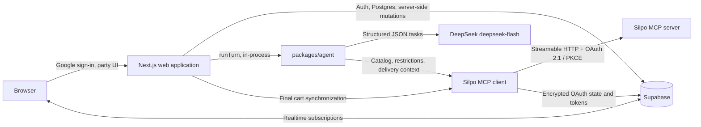

<div align="center">

# Silpo Party

### AI-powered collaborative grocery and event planning, grounded in the live Silpo catalog

[](https://nextjs.org/)
[](https://www.typescriptlang.org/)
[](https://supabase.com/)
[](https://ai-sdk.dev/)
[](https://www.deepseek.com/)
[](https://ai-factory.silpo.ua/docs/mcp)

[Live application](https://www.silpoparty.app) · [Video presentation](https://youtu.be/jMavh8r14cQ) · [Silpo MCP documentation](https://ai-factory.silpo.ua/docs/mcp)

</div>

Silpo Party turns a group conversation into a safe, budget-aware, ready-to-buy Silpo basket. Friends, families, and teams can create a shared party, describe what they need in natural language, account for every participant's food restrictions, see costs update in real time, and let the host transfer the final plan into their actual Silpo shopping cart.

The project was built as a Ukrainian-first hackathon product, but its architecture addresses a broader problem: group shopping is not simply product search. It requires coordination, catalog grounding, dietary safety, quantity planning, cost attribution, and a reliable handoff to checkout.

> [!IMPORTANT]
> Dietary-restriction checks depend on the composition data Silpo publishes (see [Food-restriction safety model](#food-restriction-safety-model)). Always check product labels; the application is not a substitute for medical advice.

## The problem

Planning food for a group usually happens across disconnected tools: one chat for preferences, another note for the shopping list, manual searches for every product, mental arithmetic for quantities, and a spreadsheet or banking app for splitting the bill. This creates recurring failure modes:

- requests are lost or duplicated as the conversation grows;
- allergies, intolerances, and dietary choices are easy to overlook;
- suggested items may not exist, be available, or match the selected Silpo store;
- recipes and packaged quantities do not naturally map to purchasable units;
- nobody knows exactly who should pay for shared and personal products;
- the organizer must rebuild the entire basket manually at checkout.

Silpo Party combines these steps into one collaborative workflow while keeping the real Silpo catalog and shopping cart as the source of truth.

## What the application delivers

- **Collaborative parties.** Create or join a party by invitation code, with up to 10 participants and clear host/member permissions.
- **Natural-language planning.** Add products, request dishes, or describe an entire event in Ukrainian through a shared chat.
- **Three planning modes.** Choose direct shopping, recipe-driven dinner planning, or autonomous event planning.
- **Live Silpo catalog grounding.** Search the active store context, hydrate candidate details, and use real identifiers, prices, package sizes, availability, ingredients, labels, and allergen metadata.
- **Budget-aware decisions.** Set an optional party budget and let the planner prioritize essentials before extras.
- **Transparent shared costs.** Attribute products to requesters, let other members opt into a product, and calculate per-person totals deterministically.
- **Realtime collaboration.** Stream messages, cart changes, member readiness, subscriptions, and agent status through Supabase Realtime.
- **Human control.** Participants can adjust quantities, remove products, and review recipes before anything reaches Silpo.
- **One-click handoff.** The host can validate the entire draft against live data and synchronize it into the creator's real Silpo cart.

## Planning modes

| Mode | Best for | Agent behavior | Cost model |
| --- | --- | --- | --- |
| **Shopping** (`SHOPPING`) | A shared grocery run with individual requests | Treats each request as a direct product addition and assigns it to the requesting member | Each product is paid for by its requester and any members who subscribe to it |
| **Dinner** (`DINNER`) | Cooking one or more dishes together | Resolves recipes, normalizes ingredient quantities, combines purchasable ingredients, and omits common pantry staples | Ingredient costs are split among the members assigned to the dish/product |
| **Event** (`EVENT`) | Picnics, birthdays, office gatherings, and other occasions | Plans a balanced set of main food, sides, drinks, sauces, and budget-permitting extras for the whole group | The full total is split evenly across all participants, down to the cent |

## How it works

1. A user signs in with Google through Supabase Auth and connects their Silpo account through OAuth 2.1 with PKCE.
2. The host creates a party, selects its mode and optional budget, then shares the join code.
3. Members write requests in the shared chat. Messages are persisted immediately and processed sequentially in the background.
4. For every turn, the web backend loads the authoritative party state, the recent chat, and each member's food restrictions from their Silpo profile, and runs the agent in-process.
5. A router model turns the message into structured operations for the party's mode: product additions, removals and quantity changes, dishes to cook, or an event brief.
6. The mode's pipeline builds a list of needs (direct products, combined recipe ingredients, or an event checklist) and resolves them in one catalog pass: a batch search, live product details, and one model call to pick the right candidate for each need. Each need succeeds or fails on its own, with a specific reason.
7. The updated plan is stored in Supabase and projected into the collaborative cart. Realtime subscriptions update every open client.
8. When the host finalizes, every product is refreshed again. Only a complete valid basket is written to Silpo; the party is marked complete after synchronization succeeds.

## Architecture

Silpo Party is a TypeScript monorepo: one Next.js application (one deployment) and two internal packages, the agent and the Silpo MCP client.



### Web application

The repository root contains the Next.js App Router application. It owns authentication, party lifecycle, invitation links, chat persistence, collaborative cart APIs, cost calculations, realtime UI state, and host-only finalization. Agent work runs in `after()` once the chat response is returned, so the browser remains responsive and observes progress through realtime status updates. Shopping-mode messages from different members are processed in parallel (up to four at a time) and merged into the plan; dinner and event messages are processed in order.

### Agent

`packages/agent` is a plain TypeScript library with one entry point, `runTurn(input, deps)`. It uses the AI SDK with DeepSeek's `deepseek-flash` model. The model never calls tools itself: deterministic code performs every Silpo call, and the model only answers narrow JSON tasks (route a message, pick a product, write a recipe or an event checklist), each validated against a Zod schema with one correction round. Routing and product picking run without hidden reasoning (about 1 s per call); recipes and event checklists use reasoning.

| Module | Responsibility |
| --- | --- |
| `src/config.ts` | Every tuning value (model, timeouts, batch sizes, history length) with where it comes from |
| `src/llm/llm.ts` | The model client: structured output, timeouts, reasoning per task |
| `src/scenarios/router.ts` | Mode-specific message routing (including brands and references to earlier messages), with a deterministic list splitter when the model is unavailable |
| `src/scenarios/dinner.ts` | Dish wishes, generated recipes, ingredient aggregation across dishes, pantry-staple filtering |
| `src/scenarios/event.ts` | Autonomous event checklist scaled to the headcount, and budget fitting |
| `src/turn/resolve-items.ts` | Search, details, restriction checks, brand checks, and candidate selection per need, with per-item failure reasons |
| `src/turn/run-turn.ts` | One chat turn end to end, within a 75-second budget |
| `src/turn/reply.ts` | The chat reply, written from a structured report after the plan is saved |
| `src/silpo/catalog.ts` | One pooled MCP connection per user, batch search, details by slug, profile restrictions, caching |
| `src/cache` | In-memory L1 plus Supabase `agent_cache` L2 for searches, details, learned product choices, recipes, and restrictions |

### Silpo MCP integration

`packages/silpo-mcp` implements the authenticated Model Context Protocol client. It handles OAuth discovery, dynamic client information, PKCE, token refresh, MCP transport, and reconnect behavior. Credentials are encrypted with AES-256-GCM before they are stored in Supabase.

`packages/agent/src/silpo/gateway.ts` adapts flexible MCP responses into a stable internal product model (only id, name, and price are required; loose produce without a measure is priced per kilogram) and holds delivery context, schema discovery, and cart writes. `packages/agent/src/silpo/catalog.ts` builds the per-turn catalog session on top of it.

To inspect live MCP responses, run `SILPO_USER_ID=<user id> npm --workspace packages/agent run probe -- [query ...]`. It saves raw catalog responses, without credentials, to `packages/agent/tests/fixtures/silpo/`.

### Data and realtime layer

Supabase provides Google authentication, PostgreSQL persistence, row-level security, and realtime change delivery. The central tables are:

| Table | Responsibility |
| --- | --- |
| `parties` | Party mode, budget, join code, lifecycle, and agent status |
| `party_members` | Membership, role, wishes, and readiness |
| `chat_messages` | Ordered user/agent conversation and processing state |
| `carts` | Structured plan, total, lifecycle, and checkout URL |
| `cart_items` | Realtime projection of the current plan's products |
| `cart_item_subscribers` | Members who opt into sharing a specific product |
| `silpo_connections` | Encrypted Silpo OAuth credentials and connection state |

Client access is read-oriented and scoped by party membership through row-level security. Privileged mutations remain in authenticated server routes.

## Silpo MCP tools used

Silpo exposes a larger MCP catalog; this application deliberately uses the subset required for identity verification, safe planning, live catalog resolution, and cart synchronization.

| MCP tool | Used for |
| --- | --- |
| `silpo_get_my_profile` | Verifying that an OAuth connection can successfully access the user's Silpo account |
| `silpo_get_my_food_restrictions` | Reading each member's dietary restrictions from their own Silpo profile |
| `silpo_get_my_shopping_cart` | Finding the creator's active cart and its current fulfillment context |
| `silpo_get_shopping_cart_by_id` | Reading branch, delivery, timeslot, and final cart data |
| `silpo_get_time_slots` | Confirming that the active cart's delivery or pickup slot is still valid |
| `silpo_find_products_batch` | Searching every product need of a turn in one batched call |
| `silpo_get_product_details` | Live price, availability, and metadata by slug, for candidates and at finalization |
| `silpo_create_shopping_cart` | Creating a cart when the connected account does not already have one |
| `silpo_clear_shopping_cart` | Preparing the real cart for an exact final synchronization |
| `silpo_add_or_update_cart_products` | Writing the validated product identifiers, branch, and quantities into the real Silpo cart |

Product discovery is context-sensitive: Silpo Party uses the creator's active branch, delivery type, and timeslot. The creator's Silpo connection is also the only connection used for the final cart, regardless of which member sent a request.

## Food-restriction safety model

Every turn reads each member's food restrictions from their own Silpo profile (`silpo_get_my_food_restrictions`, cached for 15 minutes, so a profile change applies within that time). A product is checked against the restrictions of everyone who pays for it: the requester in shopping mode, the members who want a dish in dinner mode, and everyone in event mode.

1. Silpo's profile response is normalized, including known aliases and slugs.
2. For every candidate, the product name, labels, ingredients, and allergens are compared with each restriction (`packages/agent/src/domain/restrictions.ts`).
3. A known conflict excludes the product before the model chooses.
4. A confirmed-safe product (readable composition without a conflict, an explicit label such as "безлактозне", or unaffected whole produce) is preferred.
5. When Silpo publishes no composition for any candidate, the product is still bought and the reply lists it under "Перевірте склад" with the restrictions it could not be confirmed for.
6. When every candidate conflicts, the item is not bought and the reply says so.

Recipes and event checklists are generated with the eaters' restrictions in the prompt. A profile that cannot be read produces a note in the reply rather than a failed turn.

The validator covers dietary patterns and common exclusion families such as vegan, vegetarian, pescatarian, halal, kosher, lactose, gluten, milk, egg, soy, peanut, tree nut, sesame, mustard, celery, lupin, fish, shellfish, sulphite, sugar, alcohol, caffeine, pork, beef, salt, and equivalent Ukrainian labels.

## Reliability and security

- **Validated structured output.** Zod schemas constrain workflow inputs, model answers, products, recipes, and final plans; an invalid model answer is retried once and then degrades instead of failing the turn.
- **Per-item degradation.** A failed search, missing details, or an unavailable product affects only that item; everything else is added, and the reply names the reason for each item that was not.
- **Deterministic plan protection.** A turn only adds, removes, or changes the rows it names; the previous basket is never replaced by a failed turn.
- **Controlled message processing.** One request drains a party's queue under an agent-status lock, with recovery of stale work after an interrupted deployment. Shopping turns run in parallel and each saves only its own changes on top of the latest plan; dinner and event turns run in order.
- **Atomic collaborative edits.** Database functions save a plan and its cart projection in one transaction and detect conflicting changes (expected quantities for manual edits, the cart's last update time for agent merges) rather than silently overwriting them.
- **All-or-nothing final refresh.** Every local product is re-hydrated before the real Silpo cart is touched. Missing or unavailable items stop finalization and keep the party active.
- **Host-only finalization.** Any member may contribute to planning, but only the creator can write the finished basket to Silpo.
- **Encrypted credentials.** Silpo OAuth state and tokens are encrypted at rest with AES-256-GCM and a server-only key.
- **Least exposure.** Supabase service credentials, the model API key, and the encryption key never belong in browser code; the agent runs only on the server.

## Technology stack

| Layer | Technology |
| --- | --- |
| Frontend and backend-for-frontend | Next.js 16, React 19, TypeScript |
| Styling | Tailwind CSS 4 |
| Authentication, database, realtime | Supabase Auth, PostgreSQL, Row Level Security, Realtime |
| Agent | TypeScript library on the AI SDK 7 |
| Model | DeepSeek `deepseek-flash` through `@ai-sdk/deepseek` |
| Commerce integration | Model Context Protocol SDK and the official Silpo MCP server |
| Validation and testing | Zod, Node.js test runner, ESLint |
| Deployment | One Vercel project (Node.js 24) |

## Repository structure

```text
silpo_party/
├── src/
│   ├── app/                    # Next.js pages, auth callbacks, and API routes
│   ├── components/             # Realtime party, chat, cart, and design-system UI
│   └── lib/
│       ├── agent/              # Loads party state and runs an agent turn
│       ├── cart/               # Cart projection, mutations, cost split, finalization
│       ├── chat/               # Message queue and background processing
│       ├── party/              # Party access, lifecycle, rules, and mode copy
│       └── supabase/           # Browser, server, and admin clients
├── packages/agent/
│   ├── src/
│   │   ├── domain/             # Turn contract, plan schema, quantities, restrictions
│   │   ├── llm/                # DeepSeek client with structured output
│   │   ├── scenarios/          # Message routing, dinner recipes, event checklists
│   │   ├── silpo/              # Normalized Silpo gateway and catalog session
│   │   └── turn/               # One chat turn: edits, catalog resolution, reply
│   └── evals/                  # Quality checks against the real model and catalog
├── packages/silpo-mcp/         # OAuth-enabled MCP client and credential encryption
├── supabase/migrations/        # Schema, policies, realtime, and database functions
└── DESIGN.md                   # Product and interface design direction
```

## Local development

### Prerequisites

- Node.js 24 (see `.nvmrc`)
- npm
- a Supabase project
- a DeepSeek API key
- a Silpo account for the authenticated MCP flow

### 1. Install dependencies

```bash
npm ci
```

### 2. Configure the environment

Copy `.env.example` to `.env.local`, then provide the values:

| Variable | Purpose |
| --- | --- |
| `NEXT_PUBLIC_SUPABASE_URL` | Supabase project URL |
| `NEXT_PUBLIC_SUPABASE_PUBLISHABLE_KEY` | Browser-safe Supabase key |
| `SUPABASE_SECRET_KEY` | Server-only Supabase key |
| `SILPO_CREDENTIALS_KEY` | Base64-encoded 32-byte key used to encrypt Silpo credentials |
| `AI_API_KEY` | DeepSeek API key |

Generate `SILPO_CREDENTIALS_KEY` before any users connect:

```bash
node -e "console.log(require('node:crypto').randomBytes(32).toString('base64'))"
```

> [!WARNING]
> There is no separate development database yet. A `.env.local` built from the production values (for example with `vercel env pull`) makes local runs read and write the production Supabase project, including the agent cache.

### 3. Prepare Supabase

Apply every migration in `supabase/migrations` to the target project. If the Supabase CLI is installed and linked, run:

```bash
supabase db push
```

Configure Google as a Supabase Auth provider and add the following local redirect URL to the allow-list:

```text
http://localhost:3000/auth/callback
```

### 4. Start the application

```bash
npm run dev
```

Open `http://localhost:3000`. The agent runs inside the application; there is no second service to start.

## Quality checks

Run the complete pre-release verification from the repository root:

```bash
npm test
npm --workspace packages/agent run test
npm run lint
npm --workspace packages/agent run typecheck
npm run build
```

The test suites cover party rules, modes, costs, cart mutations and merges, queue scheduling, finalization mappings, MCP authentication and normalization, restriction rules, the model client, candidate selection, and complete agent turns with a scripted model and catalog.

Prompt and model changes also need the quality checks against the real model and the real Silpo catalog (they cost tokens and take about a minute):

```bash
EVAL_SILPO_USER_ID=<a user id with a Silpo connection> npm --workspace packages/agent run eval
```

## Deployment

The application deploys as one Vercel project with the repository root as its root directory. Agent turns run in the chat route's `after()` callback, which declares `maxDuration = 300`.

Required variables:

```text
NEXT_PUBLIC_SUPABASE_URL
NEXT_PUBLIC_SUPABASE_PUBLISHABLE_KEY
SUPABASE_SECRET_KEY
SILPO_CREDENTIALS_KEY
AI_API_KEY
```

Add the production callback to the Supabase Auth redirect allow-list:

```text
https://YOUR_DOMAIN/auth/callback
```

### Secret rotation

Never commit `.env.local` or real credentials. Rotate any secret that appears in a tracked file, terminal transcript, chat, or Git history.

`SILPO_CREDENTIALS_KEY` must remain stable after users connect: changing it makes existing encrypted Silpo connections unreadable and requires every user to reconnect their account.

## Product boundaries

- Silpo Party prepares and synchronizes a cart; payment and order placement remain in Silpo's checkout experience.
- Catalog search depends on a valid Silpo fulfillment context, including the active branch and timeslot.
- Availability, price, and product metadata can change, which is why finalization performs a complete live refresh.
- Dietary validation is conservative and depends on the metadata supplied by Silpo. Users with serious allergies should always verify the packaging themselves.
- The current collaboration limits are 10 members per party and two active parties per user.

## Demo

- **Live product:** [www.silpoparty.app](https://www.silpoparty.app)
- **Hackathon presentation:** [watch on YouTube](https://youtu.be/jMavh8r14cQ)
- **Silpo MCP reference:** [AI Factory documentation](https://ai-factory.silpo.ua/docs/mcp)

---

<div align="center">
Built to make group food planning safer, faster, and genuinely checkout-ready.
</div>
